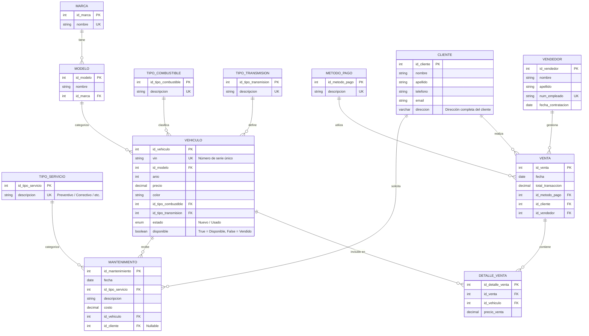

# Concesionario CampusCar
# Diseño de Base de Datos para Concesionario de Vehículos

## 1. Introducción

Este documento describe el diseño de una base de datos relacional para un concesionario de vehículos. La base de datos ha sido diseñada para gestionar la información sobre vehículos en stock, clientes, ventas y servicios de mantenimiento.

## 2. Diagrama Entidad-Relación

El siguiente diagrama muestra la estructura general de la base de datos normalizada:
<svg xmlns="http://www.w3.org/2000/svg" viewBox="0 0 1200 1100">
  <!-- Fondo -->
  <rect width="1200" height="1100" fill="#ffffff"/>
  
  <!-- Título -->
  <text x="600" y="40" font-family="Arial" font-size="24" text-anchor="middle" font-weight="bold">Diagrama Entidad-Relación: Concesionario de Vehículos</text>

  <!-- MARCA -->
  <rect x="100" y="100" width="180" height="100" rx="5" ry="5" fill="#e6f3ff" stroke="#91c5ff" stroke-width="2"/>
  <text x="190" y="130" font-family="Arial" font-size="18" text-anchor="middle" font-weight="bold">MARCA</text>
  <line x1="100" y1="140" x2="280" y2="140" stroke="#91c5ff" stroke-width="1" />
  <text x="110" y="165" font-family="Arial" font-size="14">id_marca (PK)</text>
  <text x="110" y="185" font-family="Arial" font-size="14">nombre (UK)</text>

  <!-- MODELO -->
  <rect x="100" y="250" width="180" height="120" rx="5" ry="5" fill="#e6f3ff" stroke="#91c5ff" stroke-width="2"/>
  <text x="190" y="280" font-family="Arial" font-size="18" text-anchor="middle" font-weight="bold">MODELO</text>
  <line x1="100" y1="290" x2="280" y2="290" stroke="#91c5ff" stroke-width="1" />
  <text x="110" y="315" font-family="Arial" font-size="14">id_modelo (PK)</text>
  <text x="110" y="335" font-family="Arial" font-size="14">nombre</text>
  <text x="110" y="355" font-family="Arial" font-size="14">id_marca (FK)</text>

  <!-- TIPO_COMBUSTIBLE -->
  <rect x="100" y="420" width="180" height="100" rx="5" ry="5" fill="#e6f3ff" stroke="#91c5ff" stroke-width="2"/>
  <text x="190" y="450" font-family="Arial" font-size="14" text-anchor="middle" font-weight="bold">TIPO_COMBUSTIBLE</text>
  <line x1="100" y1="460" x2="280" y2="460" stroke="#91c5ff" stroke-width="1" />
  <text x="110" y="485" font-family="Arial" font-size="12">id_tipo_combustible (PK)</text>
  <text x="110" y="505" font-family="Arial" font-size="12">descripcion (UK)</text>

  <!-- TIPO_TRANSMISION -->
  <rect x="100" y="570" width="180" height="100" rx="5" ry="5" fill="#e6f3ff" stroke="#91c5ff" stroke-width="2"/>
  <text x="190" y="600" font-family="Arial" font-size="14" text-anchor="middle" font-weight="bold">TIPO_TRANSMISION</text>
  <line x1="100" y1="610" x2="280" y2="610" stroke="#91c5ff" stroke-width="1" />
  <text x="110" y="635" font-family="Arial" font-size="12">id_tipo_transmision (PK)</text>
  <text x="110" y="655" font-family="Arial" font-size="12">descripcion (UK)</text>

  <!-- METODO_PAGO -->
  <rect x="100" y="720" width="180" height="100" rx="5" ry="5" fill="#e6f3ff" stroke="#91c5ff" stroke-width="2"/>
  <text x="190" y="750" font-family="Arial" font-size="16" text-anchor="middle" font-weight="bold">METODO_PAGO</text>
  <line x1="100" y1="760" x2="280" y2="760" stroke="#91c5ff" stroke-width="1" />
  <text x="110" y="785" font-family="Arial" font-size="14">id_metodo_pago (PK)</text>
  <text x="110" y="805" font-family="Arial" font-size="14">descripcion (UK)</text>

  <!-- TIPO_SERVICIO -->
  <rect x="100" y="870" width="180" height="100" rx="5" ry="5" fill="#e6f3ff" stroke="#91c5ff" stroke-width="2"/>
  <text x="190" y="900" font-family="Arial" font-size="16" text-anchor="middle" font-weight="bold">TIPO_SERVICIO</text>
  <line x1="100" y1="910" x2="280" y2="910" stroke="#91c5ff" stroke-width="1" />
  <text x="110" y="935" font-family="Arial" font-size="14">id_tipo_servicio (PK)</text>
  <text x="110" y="955" font-family="Arial" font-size="14">descripcion (UK)</text>

  <!-- VEHICULO -->
  <rect x="400" y="150" width="200" height="240" rx="5" ry="5" fill="#e6f7e6" stroke="#91c591" stroke-width="2"/>
  <text x="500" y="180" font-family="Arial" font-size="18" text-anchor="middle" font-weight="bold">VEHICULO</text>
  <line x1="400" y1="190" x2="600" y2="190" stroke="#91c591" stroke-width="1" />
  <text x="410" y="215" font-family="Arial" font-size="14">id_vehiculo (PK)</text>
  <text x="410" y="235" font-family="Arial" font-size="14">vin (UK)</text>
  <text x="410" y="255" font-family="Arial" font-size="14">id_modelo (FK)</text>
  <text x="410" y="275" font-family="Arial" font-size="14">anio</text>
  <text x="410" y="295" font-family="Arial" font-size="14">precio</text>
  <text x="410" y="315" font-family="Arial" font-size="14">color</text>
  <text x="410" y="335" font-family="Arial" font-size="14">id_tipo_combustible (FK)</text>
  <text x="410" y="355" font-family="Arial" font-size="14">id_tipo_transmision (FK)</text>
  <text x="410" y="375" font-family="Arial" font-size="14">disponible</text>

  <!-- CLIENTE -->
  <rect x="700" y="150" width="200" height="180" rx="5" ry="5" fill="#ffeded" stroke="#ff9191" stroke-width="2"/>
  <text x="800" y="180" font-family="Arial" font-size="18" text-anchor="middle" font-weight="bold">CLIENTE</text>
  <line x1="700" y1="190" x2="900" y2="190" stroke="#ff9191" stroke-width="1" />
  <text x="710" y="215" font-family="Arial" font-size="14">id_cliente (PK)</text>
  <text x="710" y="235" font-family="Arial" font-size="14">nombre</text>
  <text x="710" y="255" font-family="Arial" font-size="14">apellido</text>
  <text x="710" y="275" font-family="Arial" font-size="14">telefono</text>
  <text x="710" y="295" font-family="Arial" font-size="14">email</text>
  <text x="710" y="315" font-family="Arial" font-size="14">direccion</text>

  <!-- VENDEDOR -->
  <rect x="700" y="380" width="200" height="160" rx="5" ry="5" fill="#ffeded" stroke="#ff9191" stroke-width="2"/>
  <text x="800" y="410" font-family="Arial" font-size="18" text-anchor="middle" font-weight="bold">VENDEDOR</text>
  <line x1="700" y1="420" x2="900" y2="420" stroke="#ff9191" stroke-width="1" />
  <text x="710" y="445" font-family="Arial" font-size="14">id_vendedor (PK)</text>
  <text x="710" y="465" font-family="Arial" font-size="14">nombre</text>
  <text x="710" y="485" font-family="Arial" font-size="14">apellido</text>
  <text x="710" y="505" font-family="Arial" font-size="14">num_empleado (UK)</text>
  <text x="710" y="525" font-family="Arial" font-size="14">fecha_contratacion</text>

  <!-- VENTA -->
  <rect x="400" y="500" width="200" height="180" rx="5" ry="5" fill="#f5e6ff" stroke="#c591ff" stroke-width="2"/>
  <text x="500" y="530" font-family="Arial" font-size="18" text-anchor="middle" font-weight="bold">VENTA</text>
  <line x1="400" y1="540" x2="600" y2="540" stroke="#c591ff" stroke-width="1" />
  <text x="410" y="565" font-family="Arial" font-size="14">id_venta (PK)</text>
  <text x="410" y="585" font-family="Arial" font-size="14">fecha</text>
  <text x="410" y="605" font-family="Arial" font-size="14">total_transaccion</text>
  <text x="410" y="625" font-family="Arial" font-size="14">id_metodo_pago (FK)</text>
  <text x="410" y="645" font-family="Arial" font-size="14">id_cliente (FK)</text>
  <text x="410" y="665" font-family="Arial" font-size="14">id_vendedor (FK)</text>

  <!-- DETALLE_VENTA -->
  <rect x="400" y="730" width="200" height="140" rx="5" ry="5" fill="#f5e6ff" stroke="#c591ff" stroke-width="2"/>
  <text x="500" y="760" font-family="Arial" font-size="16" text-anchor="middle" font-weight="bold">DETALLE_VENTA</text>
  <line x1="400" y1="770" x2="600" y2="770" stroke="#c591ff" stroke-width="1" />
  <text x="410" y="795" font-family="Arial" font-size="14">id_detalle_venta (PK)</text>
  <text x="410" y="815" font-family="Arial" font-size="14">id_venta (FK)</text>
  <text x="410" y="835" font-family="Arial" font-size="14">id_vehiculo (FK)</text>
  <text x="410" y="855" font-family="Arial" font-size="14">precio_venta</text>

  <!-- MANTENIMIENTO -->
  <rect x="700" y="590" width="200" height="200" rx="5" ry="5" fill="#f5e6ff" stroke="#c591ff" stroke-width="2"/>
  <text x="800" y="620" font-family="Arial" font-size="16" text-anchor="middle" font-weight="bold">MANTENIMIENTO</text>
  <line x1="700" y1="630" x2="900" y2="630" stroke="#c591ff" stroke-width="1" />
  <text x="710" y="655" font-family="Arial" font-size="14">id_mantenimiento (PK)</text>
  <text x="710" y="675" font-family="Arial" font-size="14">fecha</text>
  <text x="710" y="695" font-family="Arial" font-size="14">id_tipo_servicio (FK)</text>
  <text x="710" y="715" font-family="Arial" font-size="14">descripcion</text>
  <text x="710" y="735" font-family="Arial" font-size="14">costo</text>
  <text x="710" y="755" font-family="Arial" font-size="14">id_vehiculo (FK)</text>
  <text x="710" y="775" font-family="Arial" font-size="14">id_cliente (FK, Nullable)</text>

  <!-- Relaciones -->
  <!-- MARCA - MODELO -->
  <path d="M190 200 L190 250" stroke="#336699" stroke-width="2" fill="none"/>
  <circle cx="190" cy="200" r="5" fill="#336699"/>
  <text x="195" y="225" font-family="Arial" font-size="12">1:N</text>
  
  <!-- MODELO - VEHICULO -->
  <path d="M280 300 L400 300" stroke="#336699" stroke-width="2" fill="none"/>
  <circle cx="280" cy="300" r="5" fill="#336699"/>
  <text x="330" y="290" font-family="Arial" font-size="12">1:N</text>
  
  <!-- TIPO_COMBUSTIBLE - VEHICULO -->
  <path d="M280 470 L350 470 L350 330 L400 330" stroke="#336699" stroke-width="2" fill="none"/>
  <circle cx="280" cy="470" r="5" fill="#336699"/>
  <text x="320" y="460" font-family="Arial" font-size="12">1:N</text>
  
  <!-- TIPO_TRANSMISION - VEHICULO -->
  <path d="M280 620 L330 620 L330 350 L400 350" stroke="#336699" stroke-width="2" fill="none"/>
  <circle cx="280" cy="620" r="5" fill="#336699"/>
  <text x="320" y="610" font-family="Arial" font-size="12">1:N</text>
  
  <!-- METODO_PAGO - VENTA -->
  <path d="M280 770 L320 770 L320 625 L400 625" stroke="#336699" stroke-width="2" fill="none"/>
  <circle cx="280" cy="770" r="5" fill="#336699"/>
  <text x="330" y="760" font-family="Arial" font-size="12">1:N</text>
  
  <!-- TIPO_SERVICIO - MANTENIMIENTO -->
  <path d="M280 920 L650 920 L650 695 L700 695" stroke="#336699" stroke-width="2" fill="none"/>
  <circle cx="280" cy="920" r="5" fill="#336699"/>
  <text x="330" y="910" font-family="Arial" font-size="12">1:N</text>
  
  <!-- CLIENTE - VENTA -->
  <path d="M800 330 L800 500 L600 500 L600 645 L400 645" stroke="#336699" stroke-width="2" fill="none"/>
  <circle cx="800" cy="330" r="5" fill="#336699"/>
  <text x="750" y="350" font-family="Arial" font-size="12">1:N</text>
  
  <!-- VENDEDOR - VENTA -->
  <path d="M700 460 L650 460 L650 665 L600 665" stroke="#336699" stroke-width="2" fill="none"/>
  <circle cx="700" cy="460" r="5" fill="#336699"/>
  <text x="660" y="450" font-family="Arial" font-size="12">1:N</text>
  
  <!-- VENTA - DETALLE_VENTA -->
  <path d="M500 680 L500 730" stroke="#336699" stroke-width="2" fill="none"/>
  <circle cx="500" cy="680" r="5" fill="#336699"/>
  <text x="510" y="705" font-family="Arial" font-size="12">1:N</text>
  
  <!-- VEHICULO - DETALLE_VENTA -->
  <path d="M400 300 L370 300 L370 835 L400 835" stroke="#336699" stroke-width="2" fill="none"/>
  <circle cx="400" cy="300" r="5" fill="#336699"/>
  <text x="380" y="500" font-family="Arial" font-size="12">1:1</text>
  
  <!-- VEHICULO - MANTENIMIENTO -->
  <path d="M600 270 L630 270 L630 755 L700 755" stroke="#336699" stroke-width="2" fill="none"/>
  <circle cx="600" cy="270" r="5" fill="#336699"/>
  <text x="610" y="260" font-family="Arial" font-size="12">1:N</text>
  
  <!-- CLIENTE - MANTENIMIENTO -->
  <path d="M900 240 L950 240 L950 775 L900 775" stroke="#336699" stroke-width="2" fill="none"/>
  <circle cx="900" cy="240" r="5" fill="#336699"/>
  <text x="925" y="230" font-family="Arial" font-size="12">1:N</text>

  <!-- Leyenda -->
  <rect x="900" y="870" width="200" height="130" rx="5" ry="5" fill="#f9f9f9" stroke="#cccccc" stroke-width="2"/>
  <text x="1000" y="895" font-family="Arial" font-size="16" text-anchor="middle" font-weight="bold">Leyenda</text>
  <line x1="900" y1="905" x2="1100" y2="905" stroke="#cccccc" stroke-width="1" />
  
  <rect x="920" y="920" width="20" height="15" fill="#e6f3ff" stroke="#91c5ff" stroke-width="1"/>
  <text x="950" y="932" font-family="Arial" font-size="12">Tabla de Catálogo</text>
  
  <rect x="920" y="945" width="20" height="15" fill="#e6f7e6" stroke="#91c591" stroke-width="1"/>
  <text x="950" y="957" font-family="Arial" font-size="12">Entidad Principal</text>
  
  <rect x="920" y="970" width="20" height="15" fill="#ffeded" stroke="#ff9191" stroke-width="1"/>
  <text x="950" y="982" font-family="Arial" font-size="12">Entidad Personal</text>
  
  <rect x="920" y="995" width="20" height="15" fill="#f5e6ff" stroke="#c591ff" stroke-width="1"/>
  <text x="950" y="1007" font-family="Arial" font-size="12">Entidad Transaccional</text>
</svg>

## 3. Descripción de Entidades

### 3.1 Tablas de Catálogo

#### 3.1.1 MARCA

Almacena la información de las marcas de vehículos.

| Campo | Tipo | Restricción | Descripción |
|-------|------|-------------|-------------|
| id_marca | INT | PK | Identificador único de la marca |
| nombre | VARCHAR | UK | Nombre de la marca (ej. Toyota, Ford) |

#### 3.1.2 MODELO

Almacena los modelos de vehículos asociados a cada marca.

| Campo | Tipo | Restricción | Descripción |
|-------|------|-------------|-------------|
| id_modelo | INT | PK | Identificador único del modelo |
| nombre | VARCHAR | - | Nombre del modelo (ej. Corolla, Focus) |
| id_marca | INT | FK | Referencia a la marca del vehículo |

#### 3.1.3 TIPO_COMBUSTIBLE

Catálogo de tipos de combustible que pueden usar los vehículos.

| Campo | Tipo | Restricción | Descripción |
|-------|------|-------------|-------------|
| id_tipo_combustible | INT | PK | Identificador único del tipo de combustible |
| descripcion | VARCHAR | UK | Descripción (ej. Gasolina, Diésel, Eléctrico) |

#### 3.1.4 TIPO_TRANSMISION

Catálogo de tipos de transmisión de los vehículos.

| Campo | Tipo | Restricción | Descripción |
|-------|------|-------------|-------------|
| id_tipo_transmision | INT | PK | Identificador único del tipo de transmisión |
| descripcion | VARCHAR | UK | Descripción (ej. Manual, Automática, CVT) |

#### 3.1.5 METODO_PAGO

Catálogo de métodos de pago disponibles para las ventas.

| Campo | Tipo | Restricción | Descripción |
|-------|------|-------------|-------------|
| id_metodo_pago | INT | PK | Identificador único del método de pago |
| descripcion | VARCHAR | UK | Descripción (ej. Efectivo, Tarjeta, Transferencia) |

#### 3.1.6 TIPO_SERVICIO

Catálogo de tipos de servicio de mantenimiento.

| Campo | Tipo | Restricción | Descripción |
|-------|------|-------------|-------------|
| id_tipo_servicio | INT | PK | Identificador único del tipo de servicio |
| descripcion | VARCHAR | UK | Descripción (ej. Preventivo, Correctivo) |

### 3.2 Entidades Principales

#### 3.2.1 VEHICULO

Almacena la información detallada de cada vehículo en el concesionario.

| Campo | Tipo | Restricción | Descripción |
|-------|------|-------------|-------------|
| id_vehiculo | INT | PK | Identificador único del vehículo |
| vin | VARCHAR | UK | Número de serie único del vehículo (VIN) |
| id_modelo | INT | FK | Referencia al modelo del vehículo |
| anio | INT | - | Año de fabricación |
| precio | DECIMAL | - | Precio de venta |
| color | VARCHAR | - | Color del vehículo |
| id_tipo_combustible | INT | FK | Referencia al tipo de combustible |
| id_tipo_transmision | INT | FK | Referencia al tipo de transmisión |
| estado | ENUM | - | Estado del vehículo (Nuevo/Usado) |
| disponible | BOOLEAN | - | Indica si el vehículo está disponible para venta |

#### 3.2.2 CLIENTE

Almacena la información de los clientes del concesionario.

| Campo | Tipo | Restricción | Descripción |
|-------|------|-------------|-------------|
| id_cliente | INT | PK | Identificador único del cliente |
| nombre | VARCHAR | - | Nombre del cliente |
| apellido | VARCHAR | - | Apellido del cliente |
| telefono | VARCHAR | - | Número de teléfono |
| email | VARCHAR | - | Correo electrónico |
| direccion | VARCHAR | - | Dirección completa del cliente |

#### 3.2.3 VENDEDOR

Almacena la información de los vendedores del concesionario.

| Campo | Tipo | Restricción | Descripción |
|-------|------|-------------|-------------|
| id_vendedor | INT | PK | Identificador único del vendedor |
| nombre | VARCHAR | - | Nombre del vendedor |
| apellido | VARCHAR | - | Apellido del vendedor |
| num_empleado | VARCHAR | UK | Número de empleado único |
| fecha_contratacion | DATE | - | Fecha de contratación |

### 3.3 Entidades Transaccionales

#### 3.3.1 VENTA

Registra las transacciones de venta realizadas.

| Campo | Tipo | Restricción | Descripción |
|-------|------|-------------|-------------|
| id_venta | INT | PK | Identificador único de la venta |
| fecha | DATE | - | Fecha de la transacción |
| total_transaccion | DECIMAL | - | Monto total de la venta |
| id_metodo_pago | INT | FK | Referencia al método de pago utilizado |
| id_cliente | INT | FK | Referencia al cliente que realizó la compra |
| id_vendedor | INT | FK | Referencia al vendedor que gestionó la venta |

#### 3.3.2 DETALLE_VENTA

Registra los vehículos incluidos en cada venta.

| Campo | Tipo | Restricción | Descripción |
|-------|------|-------------|-------------|
| id_detalle_venta | INT | PK | Identificador único del detalle |
| id_venta | INT | FK | Referencia a la venta |
| id_vehiculo | INT | FK | Referencia al vehículo vendido |
| precio_venta | DECIMAL | - | Precio de venta específico del vehículo |

#### 3.3.3 MANTENIMIENTO

Registra los servicios de mantenimiento realizados a los vehículos.

| Campo | Tipo | Restricción | Descripción |
|-------|------|-------------|-------------|
| id_mantenimiento | INT | PK | Identificador único del servicio |
| fecha | DATE | - | Fecha del servicio |
| id_tipo_servicio | INT | FK | Referencia al tipo de servicio realizado |
| descripcion | VARCHAR | - | Descripción detallada del servicio |
| costo | DECIMAL | - | Costo del servicio |
| id_vehiculo | INT | FK | Referencia al vehículo que recibió el servicio |
| id_cliente | INT | FK, Nullable | Referencia al cliente (opcional) |

## 4. Relaciones entre Entidades

### 4.1 Relaciones de Catálogo

- **MARCA - MODELO**: Una marca puede tener múltiples modelos (1:N).
- **MODELO - VEHICULO**: Un modelo puede estar asociado a múltiples vehículos (1:N).
- **TIPO_COMBUSTIBLE - VEHICULO**: Un tipo de combustible puede estar asociado a múltiples vehículos (1:N).
- **TIPO_TRANSMISION - VEHICULO**: Un tipo de transmisión puede estar asociado a múltiples vehículos (1:N).
- **TIPO_SERVICIO - MANTENIMIENTO**: Un tipo de servicio puede estar asociado a múltiples mantenimientos (1:N).
- **METODO_PAGO - VENTA**: Un método de pago puede estar asociado a múltiples ventas (1:N).

### 4.2 Relaciones Transaccionales

- **CLIENTE - VENTA**: Un cliente puede realizar múltiples ventas (1:N).
- **VENDEDOR - VENTA**: Un vendedor puede gestionar múltiples ventas (1:N).
- **VENTA - DETALLE_VENTA**: Una venta puede contener múltiples detalles de venta (1:N).
- **VEHICULO - DETALLE_VENTA**: Un vehículo puede estar asociado a un detalle de venta (1:1).
- **VEHICULO - MANTENIMIENTO**: Un vehículo puede recibir múltiples servicios de mantenimiento (1:N).
- **CLIENTE - MANTENIMIENTO**: Un cliente puede solicitar múltiples servicios de mantenimiento (1:N).

## 5. Restricciones e Integridad de Datos

### 5.1 Claves Primarias y Únicas

- Todas las tablas tienen definida una clave primaria (PK).
- Los siguientes campos tienen restricciones de unicidad (UK):
  - `nombre` en MARCA
  - `vin` en VEHICULO
  - `num_empleado` en VENDEDOR
  - `descripcion` en las tablas de catálogo

### 5.2 Claves Foráneas

Se han establecido relaciones mediante claves foráneas (FK) para garantizar la integridad referencial:

- El campo `id_marca` en MODELO referencia a MARCA
- Los campos `id_modelo`, `id_tipo_combustible`, `id_tipo_transmision` en VEHICULO referencian a sus respectivas tablas
- Los campos `id_cliente`, `id_vendedor`, `id_metodo_pago` en VENTA referencian a sus respectivas tablas
- Los campos `id_venta`, `id_vehiculo` en DETALLE_VENTA referencian a sus respectivas tablas
- Los campos `id_vehiculo`, `id_cliente`, `id_tipo_servicio` en MANTENIMIENTO referencian a sus respectivas tablas

### 5.3 Otras Restricciones

- El campo `id_cliente` en MANTENIMIENTO es opcional (puede ser NULL) para permitir mantenimientos a vehículos no vendidos.
- El campo `disponible` en VEHICULO debe actualizarse automáticamente a FALSE cuando el vehículo se incluye en una venta.
